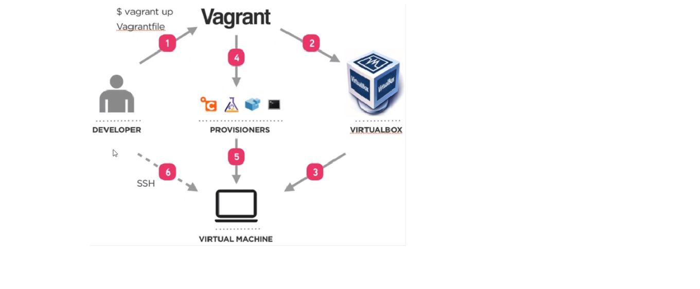

# DevOps Intro
- 
## Life before DevOps
-
### Why DevOps
-
#### Key Pillars of DevOps
- Ease of use
- Flexibility
- Robustness
- Cost Effective

##### Monilith Architecture
- A monolithic architecture is the traditional unified model for the design of a software program. Monolithic, in this context, means composed all in one piece. ... In a tightly-coupled architecture, each component and its associated components must be present in order for code to be executed or compiled.
 
- **DevOps Introduction**
- DevOps is a culture that bridges the gap between Development and Operations

- **Life before DevOps**
- BEFORE DEVOPS, the model used for software development was the “WATERFALL” Model. This model is best suited when all the requirements are present beforehand.
- Waterfall - The Waterfall methodology is a sequential development process that flows like a waterfall through all phases of a project (analysis, design, development, and testing, for example), with each phase completely wrapping up before the next phase begins. 
- V-Model - The V-model is an SDLC model where execution of processes happens in a sequential manner in a V-shape. It is also known as Verification and Validation model.This means that for every single phase in the development cycle, there is a directly associated testing phase.

- **Transition to Agile and SCRUM** 
-  Agile provides a great way for organizations to manage uncertainty. Agile commits the development team to only small bites of work (a sprint) typically two to four weeks in length, and provides them with a method of effectively dealing with rapidly changing priorities and resource constraints.

### Development Environment


- Create `Vagrantfile` in the current location
  ```
  Vagrant.configure("2") do |config|

 config.vm.box = "ubuntu/xenial64"
# creating a virtual machine ubuntu 


# assign private ip to our VM
 config.vm.network "private_network", ip: "192.168.10.100"   

 # Ensure to install hostsupdater plugin on our localhost before rerunning the vagrant
 config.hostsupdater.aliases = ["development.local"]

 # Sync folder from OS to VM
 config.vm.synced_folder ".", "/home/vagrant/app"
 
end

```
- create provision.sh
```
#!/bin/bash
sudo apt-get update -y
sudo apt-get upgrade -y
sudo apt-get install nginx -y
```
- Vagrant commands:
```
Common commands:
     box             manages boxes: installation, removal, etc.
     cloud           manages everything related to Vagrant Cloud
     destroy         stops and deletes all traces of the vagrant machine
     global-status   outputs status Vagrant environments for this user
     halt            stops the vagrant machine
     help            shows the help for a subcommand   
     hostsupdater
     init            initializes a new Vagrant environment by creating a Vagrantfile
     login
     package         packages a running vagrant environment into a box
     plugin          manages plugins: install, uninstall, update, etc.
     port            displays information about guest port mappings
     powershell      connects to machine via powershell remoting
     provision       provisions the vagrant machine    
     push            deploys code in this environment to a configured destination
     rdp             connects to machine via RDP       
     reload          restarts vagrant machine, loads new Vagrantfile configuration
     resume          resume a suspended vagrant machine     snapshot        manages snapshots: saving, restoring, etc.
     ssh             connects to machine via SSH       
     ssh-config      outputs OpenSSH valid configuration to connect to the machine
     status          outputs status of the vagrant machine
     suspend         suspends the machine
     up              starts and provisions the vagrant 
environment
     upload          upload to machine via communicator     validate        validates the Vagrantfile
     version         prints current and latest Vagrant 
version
     winrm           executes commands on a machine via WinRM
     winrm-config    outputs WinRM configuration to connect to the machine

For help on any individual command run `vagrant COMMAND -h`
```